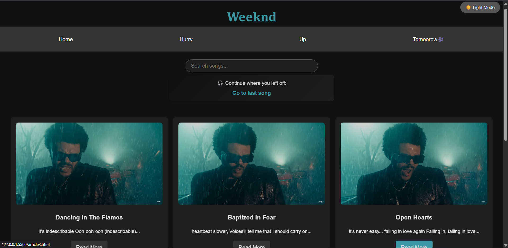
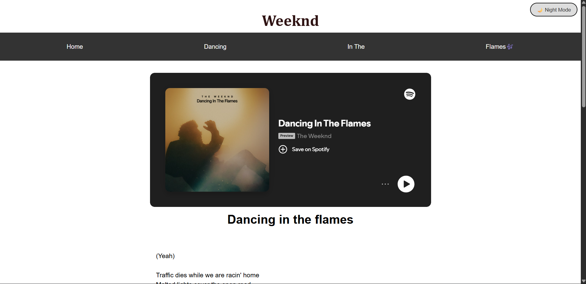

# 🎵 Weeknd Lyrics Web App

A little interactive lyrics website inspired by songs from The Weeknd.
This project demonstrates the transition from a static website to a dynamic, JavaScript-powered web application.

## Live Demo
https://lasanth-007.github.io/Song-lyric-website/
---

## 🚀 Features

* 🌙 **Dark Mode (Persistent)**

  * Toggle between light and dark themes
  * Saves user preference using `localStorage`

* 🎥 **Interactive Video Preview**

  * Videos auto-play on hover
  * Pause when mouse leaves

* 🔍 **Search Functionality**

  * Real-time filtering of songs
  * Case-insensitive matching

* 🎧 **Continue Listening**

  * Remembers last opened song
  * Quick access using `localStorage`

* 📱 **Responsive Design**

  * Works across desktop, tablet, and mobile devices

---

## 🧠 JavaScript Concepts Used

This project reflects core JavaScript fundamentals:

* DOM Manipulation
* Event Handling
* Local Storage API
* Dynamic Element Creation
* Array Iteration (`forEach`)
* Conditional Rendering

---

## 📁 Project Structure

```
project-folder/
│
├── index.html
├── article1.html ... article6.html
├── style.css
├── script.js
├── /media (videos, images)
```

---


## 🎯 Future Improvements

* Convert multiple lyric pages into a **single dynamic page (SPA)**
* Add **favorites / like system ❤️**
* Implement **playlist feature**
* Fetch lyrics dynamically using **APIs**

---

## 🧪 Learning Outcome

This project helped in understanding how to:

* Transform a static website into an interactive web app
* Apply JavaScript to real-world UI features
* Manage user state using browser storage
* Improve user experience with dynamic behavior

---

## 📸 Preview
* Home page

* Lyric page

---

## 👨‍💻 Author

* Developed as part of learning JavaScript fundamentals
* Focused on clean UI, interactivity, and user experience

